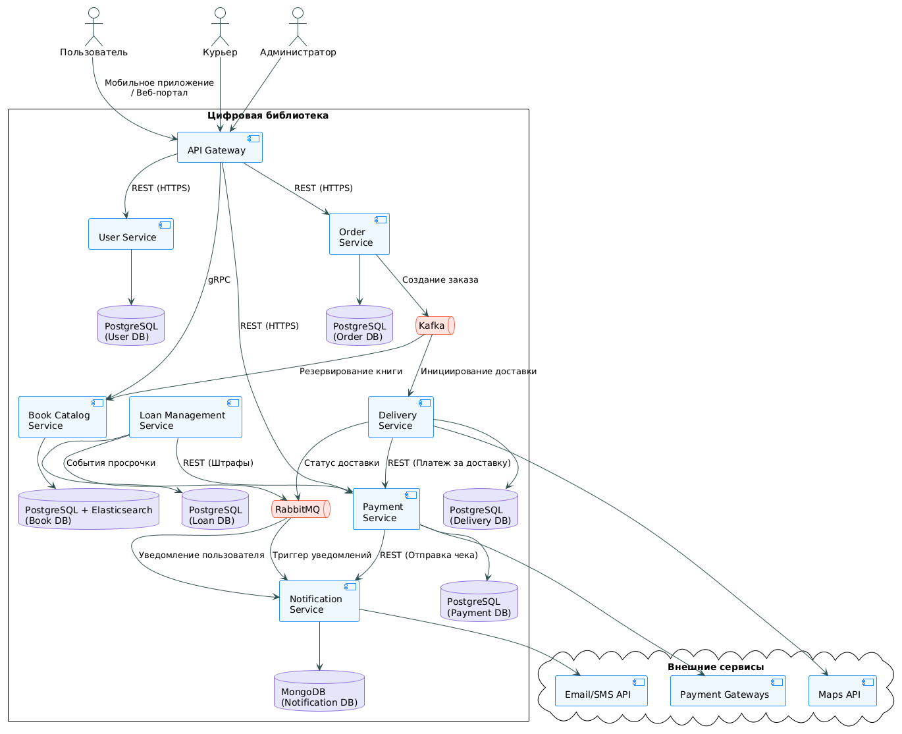

### Архитектура приложения для цифровизации библиотек

Микросервисы и технологии:

1.  **API Gateway (Nginx/Spring Cloud Gateway)**

    *   Единая точка входа для всех запросов
    *   Маршрутизация, аутентификация, кэширование

2.  **User Service**

    *   Управление пользователями (регистрация, аутентификация, профили, учетные записи)
    *   База данных: PostgreSQL (структурированные данные пользователей)
    *   Интеграция: REST API + JWT-токены

3.  **Book Catalog Service**

    *   Управление каталогом книг (поиск, наличие, метаданные)
    *   База данных: Elasticsearch (быстрый полнотекстовый поиск) + PostgreSQL (основные данные)
    *   Интеграция: gRPC для высокопроизводительных запросов

4.  **Loan Management Service**

    *   Учет выдачи/возврата книг, расчет штрафов за просрочку
    *   База данных: PostgreSQL (обеспечиение безопасностьи и целостности)
    *   Интеграция: Асинхронные сообщения через RabbitMQ

5.  **Notification Service**

    *   Отправка напоминаний (email/SMS/push)
    *   База данных: MongoDB (гибкое хранение шаблонов и логов)
    *   Интеграция: RabbitMQ (события из Loan Management)
    *   Внешние сервисы: SendGrid (email), Twilio (SMS)

6.  **Delivery Service**

    *   Управление доставкой книг курьерами
    *   База данных: PostgreSQL (маршруты, статусы заказов)
    *   Интеграция: События через Kafka (масштабируемая обработка заказов)
    *   Внешняя интеграция: Картографические сервисы (Google Maps API / Yandex Maps API)

7.  **Payment Service**

    *   Обработка безналичных платежей (штрафы, услуги)
    *   База данных: PostgreSQL (транзакционные платежи)
    *   Интеграция: Синхронные REST-вызовы для мгновенных транзакций
    *   Платежные шлюзы: Stripe/CloudPayments/СБП/Прочие платежные системы и сервисы

8.  **Order Service**

    *   Управление онлайн-заказами книг
    *   База данных: PostgreSQL
    *   Интеграция: Координация через Kafka (создание заказа → резервирование книги → инициирование доставки)

**Брокеры сообщений:**

*   RabbitMQ: Для надежной доставки событий (просрочки, уведомления)
*   Kafka: Для потоковой обработки заказов и интеграции между Delivery/Order/Catalog

**Схема взаимодействия:**

UML схема была создана с помощью редактора диаграмм PlantUML.

*   Файл с текстом диаграммы: [./scheme.uml](./scheme.uml)
*   Изображение получившейся схемы: 

**Поддержка получившейся архитектуры:**

Полученную связку микросервисов необходимо мониторить через Prometheus+Grafana (для сбора метрик и их визуализации), ELK стек для логирования и отслеживания ошибок, а также Jaeger для отслеживания запросов между микросервисами. Это позволит отслеживать работоспособность, нагрузку, безопасность и поможет аналитикам составлять отчеты о работе архитектуры
